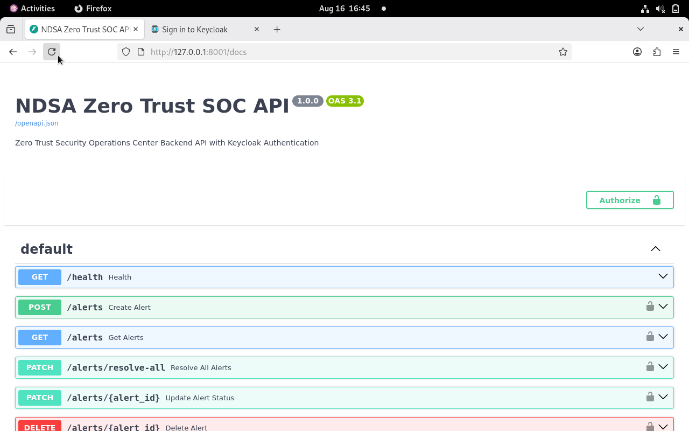
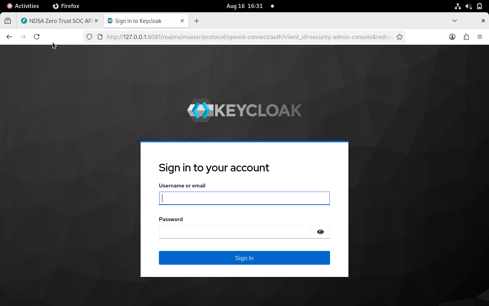
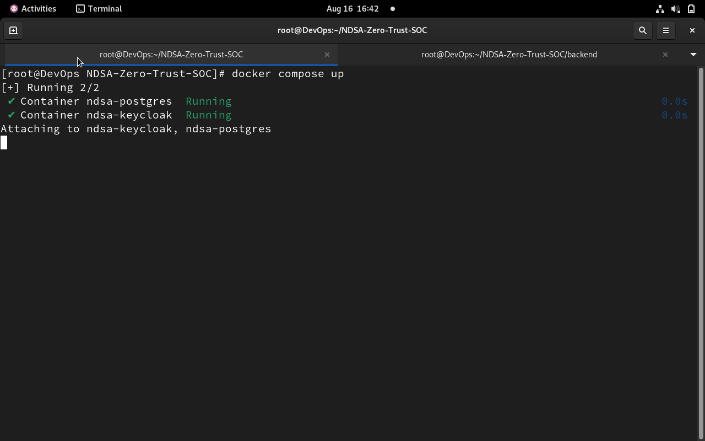
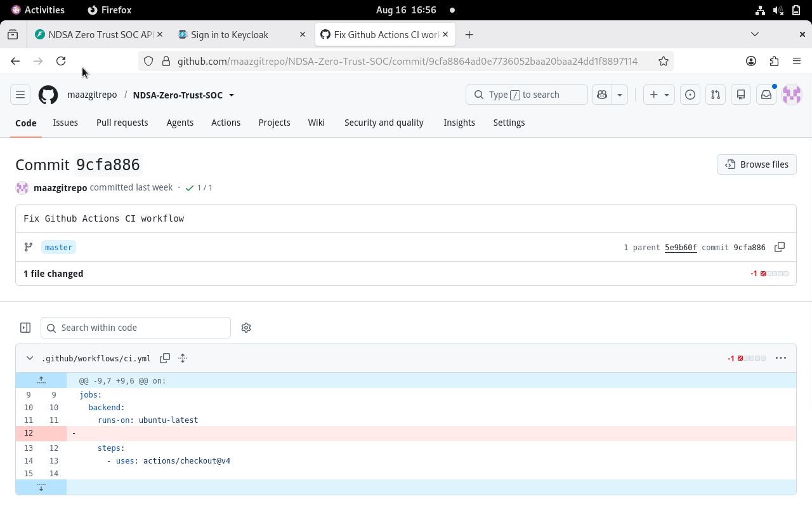
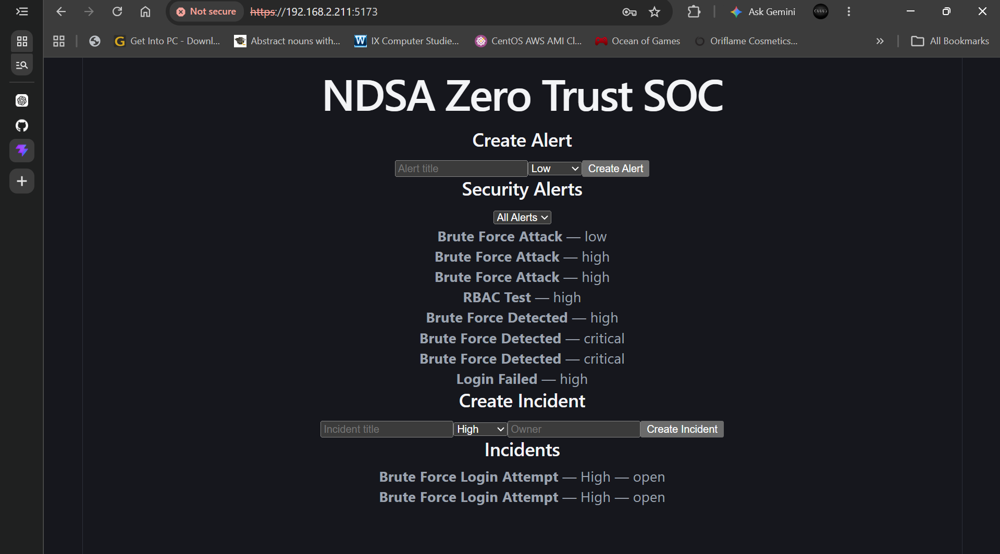
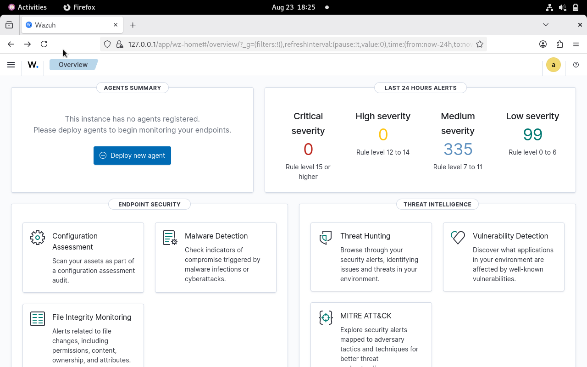

# NDSA Zero Trust Security Operations Center (SOC)

## Project Overview

The project provides secure REST APIs for alert management and incident management with authentication, role-based authorization, infrastructure automation, containerization, deployment orchestration, and security monitoring using Wazuh.

---

## Features

- Keycloak Authentication
- JWT Bearer Token Authorization
- Role-Based Access Control (RBAC)
- Alert Management APIs
- Alert Statistics
- Open Alert Count
- Severity Summary
- Search Alerts
- Incident Management
- Incident Creation
- Incident Severity and Ownership
- Wazuh Security Monitoring
- Wazuh Threat Detection
- Wazuh Vulnerability Detection
- Wazuh File Integrity Monitoring
- Filter Alerts
- Resolve All Alerts
- Docker Containerization
- Kubernetes Deployment
- Infrastructure as Code (Terraform)
- CI/CD Pipeline (GitHub Actions)
- Swagger API Documentation

---

## Technology Stack

- FastAPI
- React
- PostgreSQL
- Keycloak
- Docker & Docker Compose
- Python
- Trivy
- Wazuh
- Terraform
- Kubernetes (Minikube)
- Git
- GitHub
- GitHub Actions (CI/CD)

---

## Project Structure

```
backend/
frontend/
docs/
kubernetes/
terraform-lab/
docker-compose.yml
README.md
```

---

## API Endpoints

| Method | Endpoint | Description |
|---------|----------|-------------|
| POST | /alerts | Create Alert |
| GET | /alerts | Get All Alerts |
| GET | /alerts/{alert_id} | Get Single Alert |
| PATCH | /alerts/{alert_id} | Update Alert Status |
| PATCH | /alerts/resolve-all | Resolve All Open Alerts |
| GET | /alerts/stats | Alert Statistics |
| GET | /alerts/open-count | Open Alert Count |
| GET | /alerts/severity-summary | Severity Summary |
| GET | /alerts/filter | Filter Alerts |
| GET | /alerts/severity/{severity} | Search by Severity |
| GET | /alerts/search/title | Search by Title |
| DELETE | /alerts/{alert_id} | Delete Alert |
| GET | /incidents | Get All Incidents |
| POST | /incidents | Create Incident |

---

## Authentication

Authentication is implemented using Keycloak.

All protected endpoints require:

```
Authorization: Bearer <JWT_TOKEN>
```

---

## Running the Project

### 1. Start Docker Services

```
docker compose up -d
```

### 2. Activate Python Virtual Environment

```
source .venv/bin/activate
```

### 3. Start FastAPI

```
uvicorn main:app --host 0.0.0.0 --port 8001 --reload
```

### 4. Access Swagger UI

```
http://192.168.2.211:8001/docs
```
### 5. Start React Frontend

cd frontend
npm install
npm run dev

### 6. Access NDSA SOC Dashboard

https://192.168.2.211:5173

### 7. Access Wazuh Dashboard

https://192.168.2.211:443

---

## Documentation

Project documentation is available in the `docs/` directory.

- Installation Guide
- Deployment Guide
- API Documentation
- User Guide
- Administration Guide
- Incident Response Guide
- Trivy Security Scan


---

## Screenshots

### Swagger API Documentation


### Keycloak


### Docker Services


### GitHub Actions CI


### NDSA Zero Trust SOC Dashboard


### Wazuh Security Dashboard


---

## Author

**Maaz Farrukh**

NDSA Zero Trust Security Operations Center (SOC)
